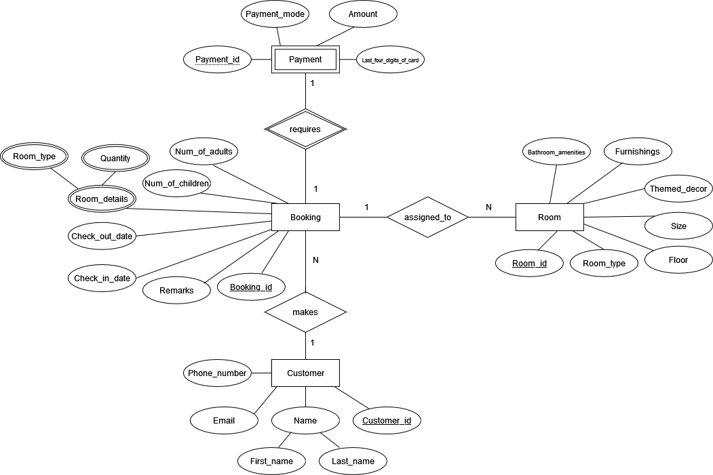

# Smart Split
Welcome to Smart Split! This is a simple application that allow users to split their bills with their friends equally
with the least transactions.

## Setting up in Intellij
Prerequisites: JDK 11, update IntelliJ to the most recent version. 
1. Download the code in a zip folder into your computer. 
2. Unzip the folder.
3. Open Intellij (if you are not in the welcome screen, click `File` > `Close Project` to close the existing project first)
4. Open the project into Intellij as follows:
    1. Click `Open`.
    1. Select the project directory, and click `OK`.
    1. If there are any further prompts, accept the defaults.
5. Configure the project to use **JDK 11** (not other versions) as explained in 
[here](https://www.jetbrains.com/help/idea/sdk.html#set-up-jdk).<br>
   In the same dialog, set the **Project language level** field to the `SDK default` option.
6. After that, locate the `src.main/SmartSplit.java` file, right-click it, and choose `Run SmartSplit.java` (if the 
code editor is showing compile errors, try restarting the IDE). If the setup is correct, you should see something like 
the below as the output:
```
Welcome to SmartSplit!
-------------------------------------------------------------------------------------------------
-------------------------------------------------------------------------------------------------
```

## Quick Start
1. Once the program is running, add all persons involved with their names and expenses. Even if they have not made any expenses, please still add
them and set their expense as 0. 
2. Once everyone has been added, type `/split` to split the bill and the transactions will be generated. 

## Assumptions 
1. Each person will only be added once into SmartSplit. This means if a person made multiple expenses, he/she has to 
pre-calculate the total expense before adding into SmartSplit.
2. Due to potential currency conversion (e.g. if friends went on a trip to Australia and made payments using AUD but 
now that they are back in SG, they want to split the bill in SGD), it is possible for money to be in more than 2 d.p..
Hence, SmartSplit accepts any number of decimal places as long as the value is within 18 significant figures. 
3. All transaction amounts will be truncated to 2 d.p..
4. If the splitting of the bill is uneven, the person who contributed the least initially will absorb the extra amount. 
5. If the transaction amount is so insignificant that when truncated becomes $0, then SmartSplit assumes that there will
be no transaction. In other words, the bill is absorbed by the person who already made the payment.
6. Users are expected to key in the input with the correct format.
<br/>
Note: Any words in <> (e.g. `<EXPENSE>`) below are placeholder text for the parameters to be supplied by the user.

## Adding a friend's expense
Command: `/add <NAME>: <EXPENSE>`
<br>
Note: <EXPENSE> should be entered without any dollar sign, just the value. 
<br>
Example:`/add Bob: 4.375`
<br>
Expected output: `Successfully added B's expenses of $4.375!`

## Splitting the bill 
Command: '/split'
<br>
Example: `split`
<br>
Expected output: 
```
Carol pays Anna $2.81
Bob pays Anna $1.82
Number of transactions: 2
```

## Tests
| Class |Method to be Tested | Scenario | Expected Output | Pass / Fail |
|----|----|----|----| ---- |
| Parser | parseAdd | `parseAdd("/add Anna: 5.34")` | ["Anna", "5.34"] | Pass |
| Parser | expensePerPerson | Anna: $5.398, Bob: $10 | 7.69 | Pass |
| Ui | addToString | `addToString("/add Anna: 5.34")` | Successfully added Anna's expenses of $5.34! | Pass |
| Ui | splitToString | Anna: $10, Bob: $3.56, Carol: $2.56 | Carol pays Anna $2.81 <br/> Bob pays Anna $1.82 <br/> Number of transactions: 2 | Pass | 
| Ui | splitToString | Anna: $5.34 | Number of transactions: 0 | Pass |
| Ui | splitToString | Anna: $5.34 Bob: $5.34 | Number of transactions: 0 | Pass |
| Ui | splitToString | Anna: $5.34 Bob: $5.35 | Number of transactions: 0 | Pass |

# Challenge 2


## Explanation of relationships
1. A customer can make many bookings(e.g. different date, same date but more rooms, etc,) but a booking can only belong 
to one customer.
2. One booking requires one payment and a payment can only belong to one booking. 
3. One booking can be assigned to many rooms (if there are >1 room booked) but one room can only be assigned to one 
customer within the same time period. 

## Assumptions made
1. Rooms of the same type vary only in size, themed decor, bathroom amenities and furnishings.
2. Payment ID and booking ID will only be issued when the payment is successful.

## Constraints
The ERD is unable to capture certain domain/value constraints such as the fact that the email and phone number of the
customer must be unique. Another such example of the domain constraint that cannot be captured is the fact that the room
types are only Standard, Deluxe and Suite. 
